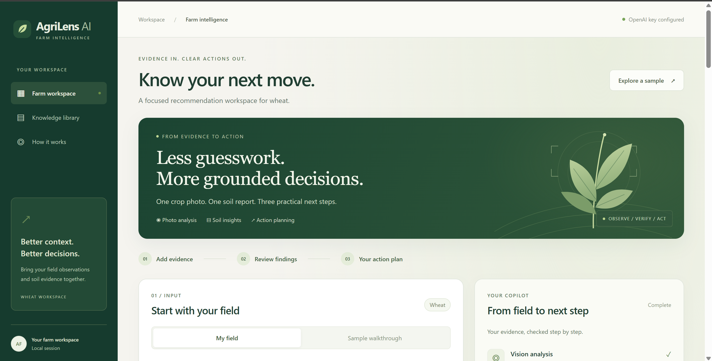
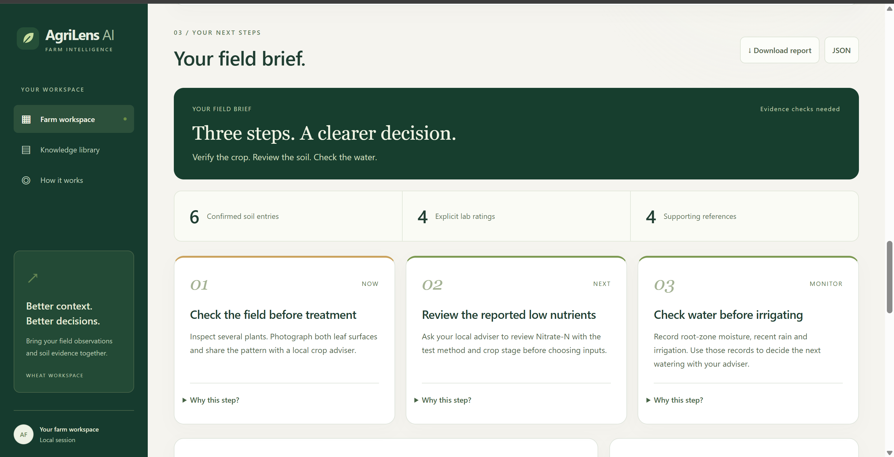
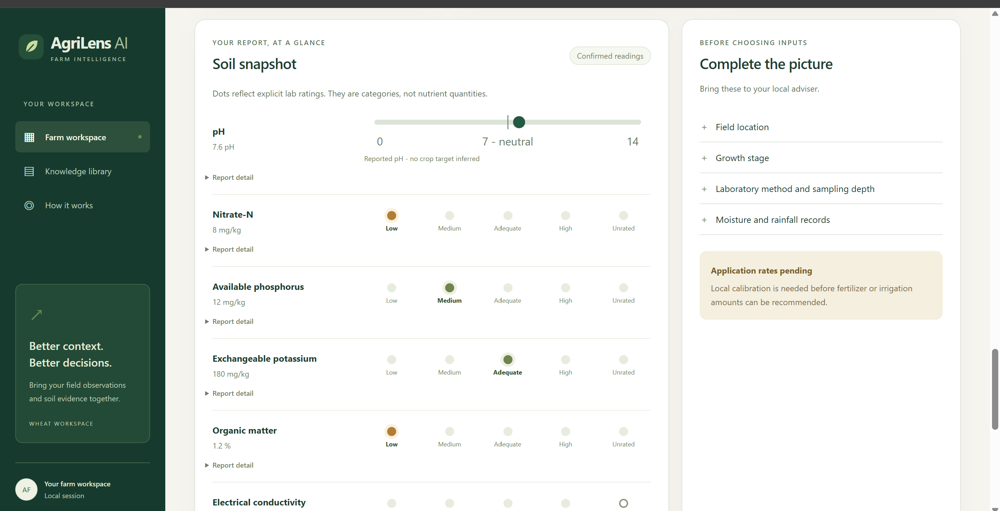
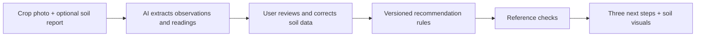

<div align="center">

# AgriLens AI

### From crop evidence to a clearer next step.

A visual decision-support workspace for wheat: crop photos, soil reports, and three practical recommendations.

**Node.js 22+ · Vanilla JavaScript · OpenAI Responses API · Rule-based recommendations**

[Quick start](#quick-start) · [Screenshots](#a-look-inside) · [How it works](#how-it-works) · [Data roadmap](DATASETS.md)

</div>



## Why AgriLens?

A crop photo and a soil report tell different parts of a field's story. AgriLens brings them into one workflow: read the evidence, let the user correct it, and present a short set of next steps with supporting references.

The core design choice: **AI extracts evidence; fixed rules select recommendations.** The app focuses on visible observations and reported measurements, while keeping missing information explicit.

## What it does

| Capability | What you see |
| --- | --- |
| Crop photo observations | Visible markings and follow-up evidence to collect |
| Soil report extraction | Editable values, units, reference ranges, and printed lab ratings |
| Three next steps | Concise **Now**, **Next**, and **Monitor** action cards |
| Visual soil snapshot | A reported pH scale and labeled dots for explicit lab categories |
| Inspectable evidence | Expandable rationale and linked reference cards |
| Portable results | Markdown and JSON downloads |
| No-key walkthrough | A clearly labeled fictional scenario with no API calls |

## A look inside

### A short field brief

Three action cards keep the next decision visible. Supporting explanations stay available on demand.



### Soil evidence at a glance

The pH scale plots the reported number. Nutrient dots show the lab's stated category; they do not imply nutrient quantities or predicted crop response.



*Screenshots show the project interface with demonstration soil values. They are not evidence of agronomic accuracy or field validation.*

## How it works



1. **Add evidence.** Supply a wheat photo, optional soil report, growth stage, and field context.
2. **Review the extraction.** Confirm or correct the report's values and units before creating a plan.
3. **Get a field brief.** Rules select evidence-gathering actions and identify what is still needed before choosing inputs.

Live mode uses one model call for a photo, plus one if a soil report is supplied, before any bounded retries. Recommendation selection and reference checks make **no model calls**. The same confirmed inputs produce the same recommendations.

## Quick start

**Requirements:** Node.js 22 or newer. There are no external npm packages to install.

```bash
git clone https://github.com/Umer-Mahmood-Khan/agrilens-ai.git
cd agrilens-ai
npm start
```

Open **http://127.0.0.1:3001** and select **Explore a sample**. The sample works without an API key.

### Enable live analysis

Copy `.env.example` to `.env`:

```powershell
# Windows PowerShell
Copy-Item .env.example .env
```

```bash
# macOS / Linux
cp .env.example .env
```

Add your key to the local `.env` file:

```dotenv
AI_PROVIDER=openai
OPENAI_API_KEY=your_key_here
OPENAI_MODEL=gpt-5.4-mini
PORT=3001
```

Restart `npm start`, choose **My field**, and upload a photo. Crop photos support JPG, PNG, and WebP; soil reports support PDF or those image formats. The limit is **8 MB per file**.

API usage is billed by your provider. Keep real keys in `.env`, which is excluded from Git. The key stays on the server and is never sent to the browser. Gemini remains an optional adapter; see the [operations guide](docs/OPERATIONS.md).

## Deploy a public demo

The repository includes a `Dockerfile` and a Render Blueprint (`render.yaml`). Both deploy a **sample-only** demo by default (`LIVE_ANALYSIS=off`), so a public URL cannot spend your API quota.

**Render:** push to GitHub, then in Render choose **New → Blueprint** and select the repository. Render supplies `PORT` and the public hostname automatically.

**Any Docker host (Fly.io, Railway, Cloud Run, a VPS):**

```bash
docker build -t agrilens-ai .
docker run -p 3001:3001 -e ALLOWED_HOSTS=your-domain.example -e LIVE_ANALYSIS=off agrilens-ai
```

| Variable | Default | Purpose |
| --- | --- | --- |
| `HOST` | `127.0.0.1` (`0.0.0.0` in Docker) | Interface to listen on |
| `PORT` | `3001` | Listening port; most platforms set it |
| `ALLOWED_HOSTS` | `localhost,127.0.0.1` | Extra public hostnames, comma-separated. Requests with any other `Host` header are refused |
| `LIVE_ANALYSIS` | on | Set `off` for a sample-only demo |
| `MAX_CONCURRENT` | `3` | Simultaneous analyses before returning 429 |

`GET /healthz` returns `{"ok":true}` for platform health checks. Serve the app over HTTPS (Render and most platforms do this for you).

Turning live analysis on in public means anyone with the URL can upload files at your expense. There are no user accounts or per-visitor rate limits yet. Sessions live in process memory, so run a single instance.

## Project structure

```text
agrilens-ai/
├── server.mjs               HTTP server, health check and in-memory sessions
├── Dockerfile, render.yaml  Container image and Render Blueprint
├── lib/
│   ├── ai.mjs               OpenAI / Gemini adapters and bounded retries
│   ├── pipeline.mjs         Extraction, confirmation, and planning workflow
│   ├── recommendations.mjs  Versioned recommendation rules
│   ├── knowledge.mjs        14 scoped editorial reference cards
│   ├── schemas.mjs          Structured output schemas and validation
│   └── sample.mjs           Fictional walkthrough data
├── public/                  Interface, charts, and lab-rating parser
├── test/                    Native Node.js tests; mocked provider calls
├── scripts/                 Live connection and workflow diagnostics
├── sample-data/             Public reference photos and synthetic report
├── gitimages/               Screenshots used in this README
├── docs/OPERATIONS.md       Detailed setup and troubleshooting
└── DATASETS.md              Larger dataset research and integration criteria
```

## Validation

```bash
npm test                 # Offline tests; no API key or API charges
npm run check:ai         # Live connection and structured-output check
npm run check:workflow   # Live extraction + deterministic recommendation check
```

The suite covers extraction paths, provider key isolation, missing evidence, corrected soil readings, deterministic recommendations, chart inputs, invalid references, upload validation, and retry/resume behavior. Live diagnostics use your selected provider and may incur API charges.

The updated workflow has passed the offline test suite and a live OpenAI check using the included public photo and synthetic soil report. These checks verify software behavior, **not agricultural treatment accuracy**.

## Evidence and data roadmap

The current library contains **14 short editorial reference cards** from FAO, university extension, ISRIC, and Punjab agriculture sources. Each card carries a source link and scope. Rule-selected references support the next steps; the app does not browse the web during analysis.

Larger candidates include WoSIS soil records, CSISA nutrient omission trials, and wheat nutrient response datasets. **These datasets have not been imported or used to train this app.** Geographic fit, analytical methods, reuse terms, and local validation matter before incorporating them into recommendations.

Read the [dataset shortlist and integration criteria](DATASETS.md).

## Current scope

- **Working prototype for wheat.** Deployable as a public sample-only demo; live analysis is intended for local or access-controlled use.
- **Decision support, not diagnosis.** It does not prescribe fertilizer rates, pesticides, or irrigation quantities, or predict yield.
- **Human confirmation matters.** AI can misread an image or report; users review soil readings before planning.
- **No inferred soil categories.** Missing or unrecognized lab ratings stay unrated. A numeric result alone does not trigger a low/high classification.
- **Local validation remains future work.** Editorial rules are not field-validated treatment recommendations for Pakistan or other regions.

### Data handling

Live uploads and notes are sent to the selected AI provider. Uploaded files are not saved to disk. Extracted results and resumable workflow data are held in process memory; restart clears them. Sessions expire after 30 minutes of inactivity, with cleanup on subsequent access. OpenAI requests use `store: false`; provider data policies still apply.

By default the server binds to localhost and accepts only local hosts and same-origin requests. Public deployments list their hostname in `ALLOWED_HOSTS` and should keep `LIVE_ANALYSIS=off` unless access controls and usage limits are in place.

## Next milestones

- [x] Public sample-only demo with deployment configuration
- [ ] Access control and per-visitor limits for public live analysis
- [ ] Locally reviewed wheat recommendation rules
- [ ] Licensed, method-aware dataset ingestion
- [ ] Field-case evaluation with a local agronomist
- [ ] Validated moisture and weather inputs for water planning

## License

Project code is available under the [MIT License](LICENSE). Third-party photos and source publications retain their own terms and attribution requirements.

## Credits

Reference sources are linked in the application and [dataset notes](DATASETS.md). Included crop photo credits and synthetic report details are documented in [sample-data/README.md](sample-data/README.md). Source organizations do not endorse this project.

---

**AgriLens AI — evidence in, clear actions out.**